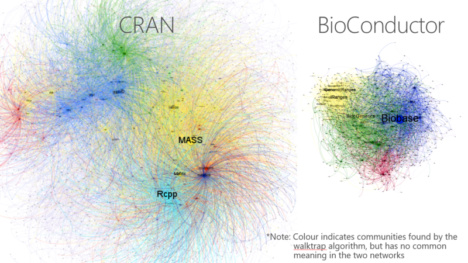

```{r setup, include=FALSE}
knitr::opts_chunk$set(echo = FALSE)
```

## Course content

```{r, include=FALSE}
library(lubridate)
d1 = ymd("2022-10-07")
```

* __`r format(d1, '%d/%m')`__.- Introduction to R and automatic reporting (__Marc__)
* __`r format(d1 + weeks(1), '%d/%m')`__.- Data manipulation and tidying data (__Marc__)
* __`r format(d1 + weeks(2), '%d/%m')`__.- Creating graphics with `ggplot2` (__Marc__)
* __`r format(d1 + weeks(3), '%d/%m')`__.- Overview of probability. Simulation (__Marc__)
* __`r format(d1 + weeks(4), '%d/%m')`__.- Overview of statistical inference (__Marc__)
* __`r format(d1 + weeks(5), '%d/%m')`__.- Overview of data science. Data preprocessing (__Karina__)
* __`r format(d1 + weeks(6), '%d/%m')`__.- DMMCM map and dimensionality reduction (__Karina__)
* __`r format(d1 + weeks(7), '%d/%m')`__.- Regression (__Karina__)
* __`r format(d1 + weeks(8), '%d/%m')`__.- Classification (__Karina__)
* __`r format(d1 + weeks(10), '%d/%m')`__.- Clustering (__Karina__)

## Today's session

```{r, echo=FALSE, results='asis'}
cat(readr::read_lines("session-01-content.md"), sep='\n')
```

# R and RStudio

## The R Project for Statistical Computing

* R is a programming language for statistical computing.
* The main implementation is the one available at the __The Comprehensive R Archive Network__ (CRAN). 
  * Other implementations exist:  __Microsoft R Open__ (MRAN), __TIBCO® Enterprise Runtime for R__  (TERR), ...
* R (CRAN) runs on Unix-like systems, Windows and Mac.
* R (CRAN) can be download at <https://cran.r-project.org>.

## RStudio Desktop

* RStudio Desktop is a free integrated development environment (IDE) for R.
* It incorporates: 
  * A __`Console`__ pane to execute instructions interactively.
  * An __`Environment`__ pane to control existing variables.
  * An R script editor. Supporting other languages: `html`, `css`,  `markdown`, `python`, `C/C++`, ...
* RStudio is becoming Posit <https://posit.co/>.
* RStudio Desktop can be download at <https://rstudio.com/products/rstudio/download/>.

## RStudio alternatives

* __R Extension for Visual Studio Code__,
* __R tools__ (Visual Studio),
* __StatET for R__ (Eclipse),
* __Jupyter__ with an R kernel (`IRkernel`) or
* any text editor: Emacs, Atom, ...


## Automatic reporting

* __Knitr__. Converts a text document with embedded code into a new document by executing the code and "knitting" the result back into the document. For example,
  * `.Rmd` file into `.md` file
  * `.Rhtml` file into `.html` file
  * `.Rnd` file into `.tex` file
* __R Markdown__. Converts `Rmd` files into a variaty of different formats: documents, presentations, books, websites, dashboards, ...

## Recommended R book

```{r, out.width='30%', fig.align='center', fig.cap='[Wickham & Grolemund (2017). R for Data Science](https://r4ds.had.co.nz/)'}
knitr::include_graphics('session-01-presentation/r4ds.png')
```

## Recommended (non-R) book

```{r, out.width='30%', fig.align='center', fig.cap='[Wilke (2020). Fundamentals of Data Visualization](https://clauswilke.com/dataviz/) <br/><br/> Sources with R code at [https://github.com/clauswilke/dataviz](https://github.com/clauswilke/dataviz)'}
knitr::include_graphics('session-01-presentation/dataviz.png')
```

#  The R language

## Executing R scripts

* From RStudio:
  * Current line or selection execution (Ctrl+Enter)
* Calling the script within R: `source("script_file.R")`
* Calling from system's terminal: `Rscript script_file.R`

## Functions {.smaller}

Structure:

```r
my_function <- function(...){
  ...
  # Some code
  ...
  return(some_result)
}
```

It is common to avoid the `return()` statement:

```r
my_function <- function(...){
  ...
  # Some code
  ...
  some_result
}
```

## Vectors

* __Atomic vectors__.
    * `logical`, 
    * `integer`, 
    * `numeric`, 
    * `character`, and also
    * `raw` and `complex`.
* __Lists__.

Arrays (`array`) and matrices (`matrix`) are dimensionated vectors.

## Subsetting

* Positive integers
* Negative integers
* Logical vectors
* Vector of names (only with named vectors)


## R packages

```{r, fig.align='center', fig.cap="<br><br>[CRAN](https://cran.r-project.org/web/packages/) and [Bioconductor](https://www.bioconductor.org/) are the main package repositories of R. <br/>[Github](http://github.com) contains lots of packages."}

```

## `tidyverse`: R packages for data science

The [`tidyverse`](https://www.tidyverse.org/) is an opinionated [collection of R packages](https://www.tidyverse.org/packages/) designed for data science. All packages share an underlying design philosophy, grammar, and data structures.

Install the complete tidyverse with:

```{r, eval=FALSE, echo=TRUE}
install.packages("tidyverse")
```

## Iteration {.smaller}

* For-structure:

```r
for(i in S){
  ...
  # Some code
  ...
}
```

* With `base` package:<br>
`sapply(x, f)`, `lapply(x, f)`<br>
`mapply(f, x1, x2, ...)`
* With `purrr`: <br>
`map()` (`map_lgl()`, `map_int()`,  `map_dbl()` and `map_chr()`)<br>
`map2()` (`map2_lgl()`, `map2_int()`,  `map2_dbl()` and `map2_chr()`)<br>
`pmap()` (`pmap_lgl()`, `pmap_int()`,  `pmap_dbl()` and `pmap_chr()`)

# That's all for today

## Next week session

```{r, echo=FALSE, results='asis'}
cat(readr::read_lines("session-02-content.md"), sep='\n')
```
